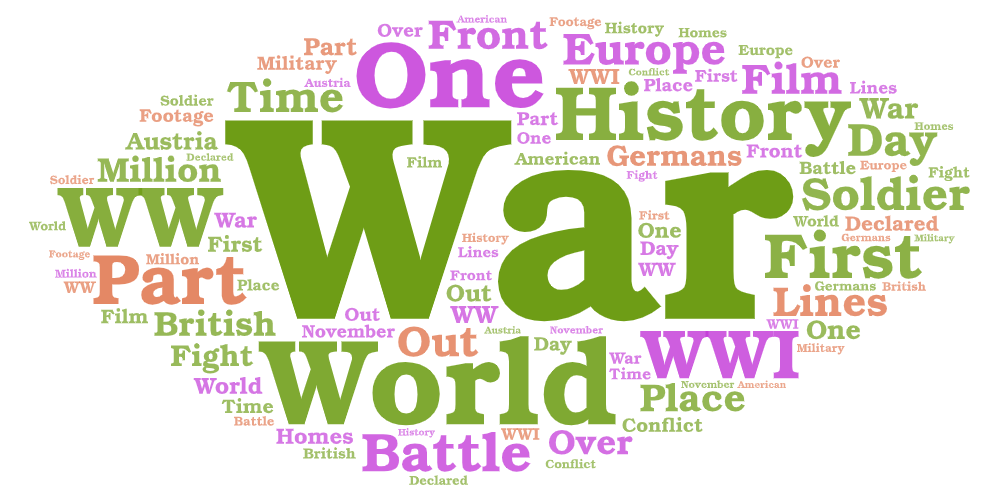
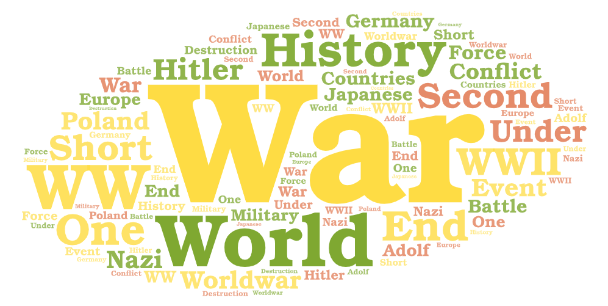
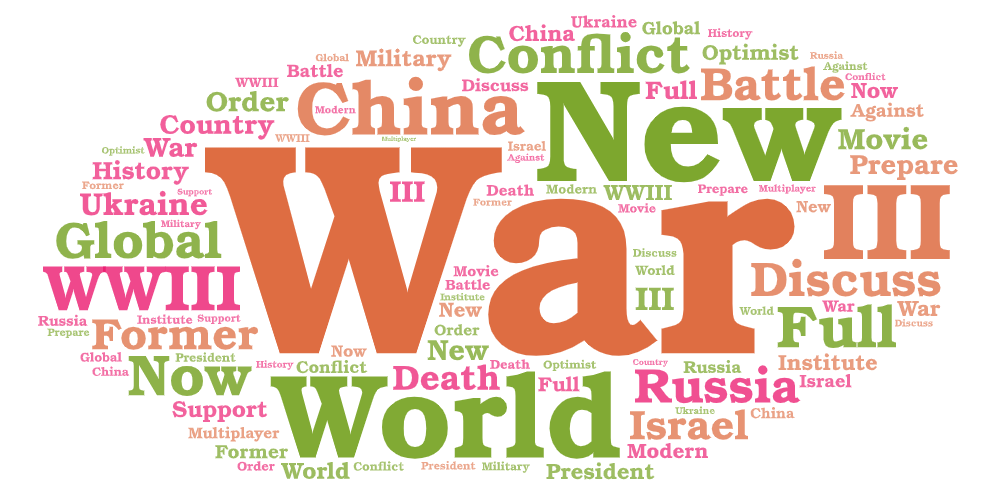

# GEOG 458 Lab 2

## Topic and Paramters - the topic as well as the parameters you have used for search

In my research, I decided to explore the topic of World War, particuarily looking at what words are associated or come up with the two Wars that have occured and seeing what words are associated for World War 3, a war that has not occured. Below are the search terms I used for the different World Wars from I to III.

search_terms = ["WW1", "World War 1", "World War I", "WWI"]

search_terms = ["WW2", "World War 2", "World War II", "WWII"]

search_terms = ["WW3", "World War 3", "World War III", "WWIII"]

## Comparison Rationality - why do you want to make this comparison

I wanted to make this comparison because I wanted to see whether or not the two World Wars were talked about differently on Youtube, and also see how they contrast with talks of World War 3. Also, I wanted to see what words were used to describe the different wars and see what the videos talked about. Additionally, with the different variations of how you could input World War as a search term, it satisfied the expectation of using at least three different search terms.

## Word Cloud Comparison - compare the word clouds and discuss the difference or similarity among the word clouds
### Word Cloud for World War 1 Search Terms

### Word Cloud for World War 2 Search Terms

### Word Cloud for World War 3 Search Terms

Above, the three different world clouds for each of the search terms for World War 1, 2, and 3 are shown. Throughout the different word clouds, the word "war" is the largest and most prevalent thorughout the videos. Additionally, the word "world" is quite large in each of the word clouds. One easily noticeable diference between the WW1 and WW2 word clouds is that the word "history" is present in the word clouds, while in the WW3 word cloud, the word "new" is present. Also, in the WW1 and WW2 word clouds, no countries are noticeably large, whearas in WW3, the county "China" is large. Overall, thorughout the words clouds, participatory units (or specullated ones) such as countries and people are present in the words clouds.

## Pattern Analysis - what might be the possible reasons for the patterns you observed

A possible reason for the pattern I observed is that the word "war" is present in the topics I wanted to explore and "World War" can be abbereviated in communication to "war." Additionally, another word that is quite prevalent is "world," just at a smaller text than "war;" this is because the topic I am researching is "World War." Another pattern between the word clouds is the word "history" in the WW1 and WW2 word cloud, which may be observed because both of the wars already occured and are a part of history, whearas WW3 has not occurred. In regards to the words "new" and "China" in the WW3 word cloud, WW3 would be a new war and it appears that China may be a part of it, similar to how figures like Hitler and countires like Europe were part of the WW1 and/or WW2 word clouds. Additionally, a number of participatory units are present which is likely due to the YouTube videos talking about what occured or what may occur in the wars. 

## Future Improvements - how your research could be improved in the future

In the future, my research could be improved by having the crawler parse through more videos, more than the approximate 20 that my current scroll retrieved for each of the word clouds. In order to do this, I coulld change the `range` in `for i in range(5):`to be higher because `i` indicates the number of times that scrolls down a web page.

## Interesting Observations - anything you find from the map or data that is different from your expectation before the exercise, or anything that stands out to you

One thing that stands out to me about the word clouds is how there is a lack of years or months. I would imagine in videos talking about the World Wars that they say when the war started and ended for WW1 and WW2. For WW3, however, there is a lot of video speculations, so the date or years for those I would expect to be much more scattered, and thus, not apparent in the word cloud.

### CSV Links
[WW1 CSV](https://drive.google.com/file/d/11HunQI6eQzl6kQ13ClFy45ks0UqWBte0/view?usp=sharing)

[WW2 CSV](https://drive.google.com/file/d/1-1tdCMsc0yy-0XgM0dXvhntvyWpjZgDv/view?usp=sharing)

[WW3 CSV](https://drive.google.com/file/d/1nkv84FC_oOLwbintBt-mfhNKZRmhPei3/view?usp=sharing)
